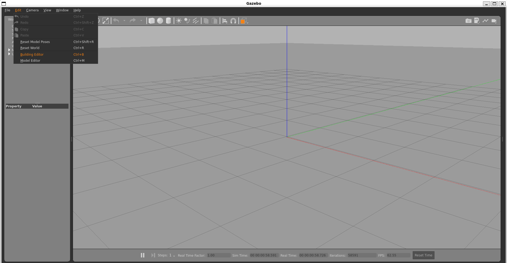

#########################################
###                                   ###
###              METR4202             ###
###                REPO               ###
###   CREATED 22/07/2024 - JACK BOYD  ###
###                                   ###
#########################################

Hi, welcome to the METR4202 repo, this is where all code for the course will be stored for this group

## TEAM MEMBERS ##
Jack Boyd - 47500037

amaana hussain - 4582775

Ngo Sen Lui - 47266641

Ole Fjeld Haugstvedt - 402216998


## Repo Struture ##
    /maps
        /Floor_Plans 
            floor_plan_name.sdf

        /map_name_1
            map_name_1.world
            map_name_1.launch.py

        /map_name_2
            map_name_2.world
            map_name_2.launch.py

        ...

    /packages
        /package_name
        setup.py
        packges.xml
            /package_name
                __init__.py
                package_name.py
                ... (Other python files or subdirectories ...)

## Creating Maps ##
When wanting to use a map from the repo, first you need to create a folder where all the maps will be saved
```
mkdir -p path_to_folder/metr4202_maps
mkdir path_to_folder/metr4202_maps/Floor_Plans
```

To create a world, start by creating a new folder in maps:
mkdir path_to_folder/metr4202_maps/Maps/map_name
Now open Gazebo and start by creating a floor plan by navigating to Editor -> Building editor


Once you have created a floor plan, navigate to File -> Save As, name your file name_Floor_Plan and make sure the loaction is path_to_folder/metr4202_maps/Floor_Plans

Once you have saved the floor plan, naviagte to File -> Exit Building Editor

The floorplan should be automatically added to your world. If not, then you can now insert your Floorplan into your world by navigating to Insert, and your should see the FloorPlan folder below. 

Once the floor plan is added, you can now start adding obstacles and AaruCo markers around the world using gazebo, (Make sure obstacles are static)

Once you have finalised the design, navigate to File -> Save World As
make sure the location is 
path_to_folder/metr4202_maps/Maps/map_name and the name is map_name.world

Then you will need to create a launch.py script. Copy the launch.py script from this repo to a file and call it map_name.launch.py and make sure it is saved in location 
path_to_folder/metr4202_maps/Maps/map_name, and make sure to edit where needs editing

Once this is done, you will need copy the .world file to:
path_to_turtlebot3_ws/src/turtlebot3_simulations/turtlebot3_gazebo/worlds
Once this is done, you will need copy the .launch.py file to:
path_to_turtlebot3_ws/src/turtlebot3_simulations/turtlebot3_gazebo/launch

then run the following commands:
```
cd path_to_turtlebot3_ws/
colcon build
source install/setup.bash
```
Then you should be able to open the world with gazebo by running:
```
ros2 launch turtlebot3_gazebo map_name.launch.py
```

## Using Maps ##
Navigate to the Maps folder in the repo and do the following

Copy the .world file to:
path_to_turtlebot3_ws/src/turtlebot3_simulations/turtlebot3_gazebo/worlds
Once this is done, you will need copy the .launch.py file to:
path_to_turtlebot3_ws/src/turtlebot3_simulations/turtlebot3_gazebo/launch

then run the following commands:
```
cd path_to_turtlebot3_ws/
colcon build
install/setup.bash
```
Then you should be able to open the world with gazebo by running:
```
ros2 launch turtlebot3_gazebo map_name.launch.py
```

    

            


